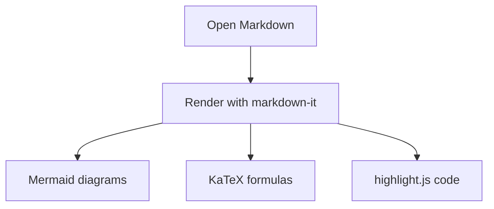

# MdViewer Sample

This document demonstrates Markdown, Mermaid, math formulas, tables, and code highlighting.

## Mermaid



## Math

Inline formula: $E = mc^2$.

Block formula:

$$
\int_0^1 x^2\,dx = \frac{1}{3}
$$

## Code

```csharp
Console.WriteLine("Hello, Markdown!");
```

## Table

| Feature | Status |
| --- | --- |
| Markdown | OK |
| Mermaid | OK |
| KaTeX | OK |
| Code highlight | OK |
